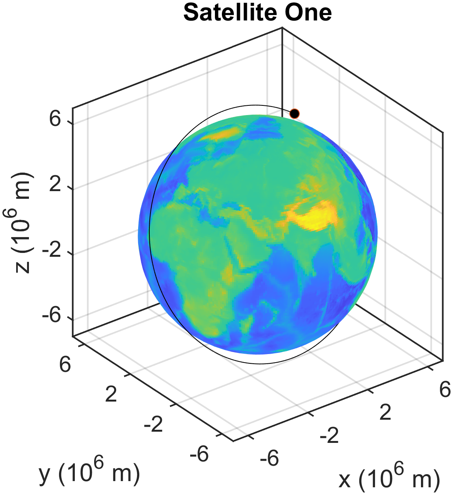
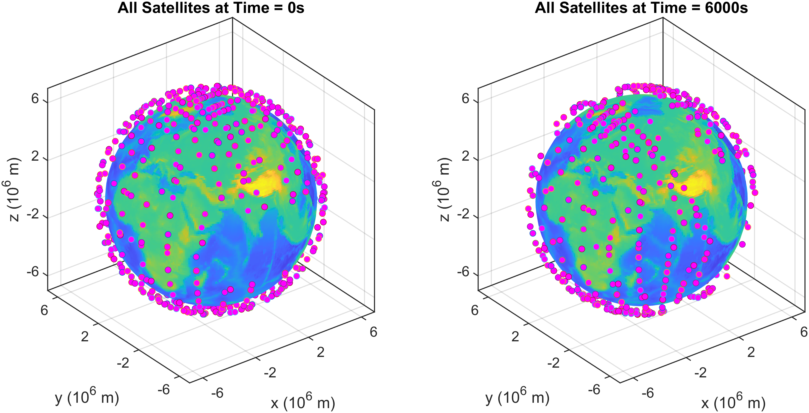
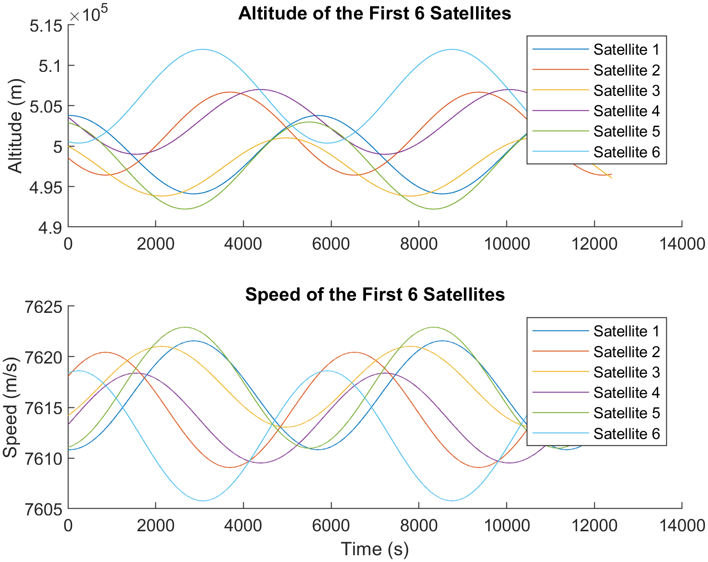

# Satellite Simulation Project
This project was developed for a MATLAB-based mechanical engineering programming course.

## Overview
Developed and visualized a large-scale orbital simulation modeling the trajectories of thousands of satellites using Newton’s Second Law and the Euler-Cromer numerical integration method.

## Physics Model 
The simulation models satellite motion under gravitational forces, with optional atmospheric drag, using Newton’s Second Law. Each satellite is treated as a point mass orbiting Earth.

The governing equation of motion is:

a = - (G * M / r^3) * r  -  (Cd * rho * A / (2m)) * v * |v|

where:

G = gravitational constant,
M = mass of Earth,
r = position vector,
v = velocity vector,
Cd = drag coefficient,
rho = atmospheric density,
A = projected area,
and m = satellite mass

The equations of motion are integrated using the Euler-Cromer method:

v(n+1) = v(n) + a(n) * dt

r(n+1) = r(n) + v(n+1) * dt

This method improves numerical stability compared to standard Euler integration, making it suitable for long-duration orbital simulations.

The model assumes a simplified two-body system and neglects higher-order perturbations such as atmospheric variation and gravitational influences from other bodies.

## Key Features
- Simulates large-scale multi-body orbital motion
- Efficient numerical integration using Euler-Cromer method
- 3D visualization of satellite trajectories
- Automated extraction of orbital characteristics

## Results / Visualization

### Single Satellite Orbit

  

Visualization of an individual satellite orbiting Earth, demonstrating the simulated trajectory generated from the Euler-Cromer integration method.

### Multi-Satellite Orbital Evolution

  

Comparison of satellite positions at the start of the simulation and after 6000 seconds, showing the evolution of the orbital system over time.

### Altitude and Speed vs. Time

  

Time-history plots of altitude and speed for the first six satellites, illustrating periodic orbital behavior and variation in satellite motion.

## Tools Used
- MATLAB

## Technical Contributions
- Implemented a numerical solver to compute the time evolution of satellite position and velocity
- Applied Newton’s Second Law using the Euler-Cromer integration scheme
- Developed modular functions for simulation, data input, and trajectory computation
- Generated 3D visualizations for both individual and multi-satellite systems
- Produced time-series plots to analyze orbital behavior
- Computed orbital period and total distance traveled for each satellite

## How to Run
1. Download all project files:
   - `MAE_8_Project.m`
   - `earth_topo.m`
   - `read_input.m`
   - `satellite.m`
   - `satellite_data.txt`
2. Open `MAE_8_Project.m` in MATLAB
3. Run the script
